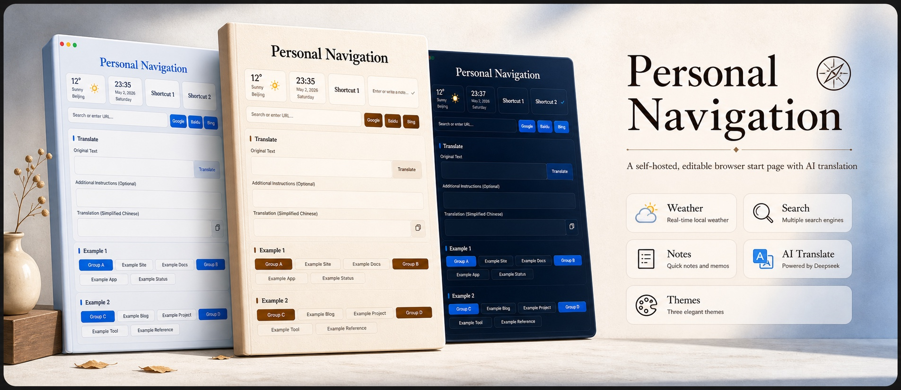

# Personal Navigation



Personal Navigation is a small self-hosted homepage for bookmarks, quick search, notes, weather, and AI-assisted translation. It gives you a private browser start page that can keep frequently used links, run Google/Baidu/Bing searches, show current weather, save a lightweight note, and translate text with an OpenAI-compatible chat model. The repository also includes Say Lab as an optional integrated module that can run as a separate service and open from the navigation page.

中文文档：[README.md](README.md)

## Screenshots


## Features

- Bookmark groups with editable categories and links
- Google, Baidu, and Bing quick search buttons
- Weather widget powered by QWeather
- Local note widget saved on the server
- Collapsible translation panel with source text, optional context, Markdown output, copy action, and configurable target language
- Optional integrated Say Lab module for AI pronunciation guidance, cloud TTS, reading scripts, and bilingual reference text
- Three built-in themes: default, paper-like editorial, and midnight

The translator defaults to Simplified Chinese. After expanding the panel, click the “译文” label to switch the target language or enter a custom target instruction.

## Quick Start

```bash
python3 -m venv .venv
source .venv/bin/activate
pip install -r requirements.txt
python app.py
```

Then open:

```text
http://127.0.0.1:5555
```

For production, run it behind your own web server or process manager:

```bash
gunicorn -c gunicorn_conf.py app:app
```

## Configuration

Set configuration with environment variables. `env.example` shows the commonly used values.

| Variable | What It Controls | Default |
| --- | --- | --- |
| `SITE_TITLE` | Page title and main heading | `Personal Navigation` |
| `DEFAULT_WEATHER_LOCATION_ID` | Default QWeather location ID | `101010100` |
| `DEFAULT_WEATHER_LOCATION_NAME` | Default city label shown before weather loads | `Beijing` |
| `DEFAULT_SEARCH_ENGINE` | Search engine used when pressing Enter in the search box. Valid values: `google`, `baidu`, `bing` | `google` |
| `SHORTCUT_ONE_LABEL` | Label for the first shortcut card | `Shortcut 1` |
| `SHORTCUT_ONE_URL` | URL opened by the first shortcut card | `https://example.com/shortcut-1` |
| `SHORTCUT_TWO_LABEL` | Label for the second shortcut card | `Shortcut 2` |
| `SHORTCUT_TWO_URL` | URL opened by the second shortcut card | `https://example.com/shortcut-2` |
| `SAY_LAB_URL` | Say Lab entry URL; leave empty to hide the entry | empty |
| `NAV_DEFAULT_TITLE_FONT` | Heading font for the default theme | `system-ui` |
| `NAV_DEFAULT_BODY_FONT` | Body and control font for the default theme | `system-ui` |
| `NAV_EDITORIAL_TITLE_FONT` | Heading font for the paper-like theme | `Songti SC` |
| `NAV_EDITORIAL_BODY_FONT` | Body and control font for the paper-like theme | `Songti SC` |
| `NAV_MIDNIGHT_TITLE_FONT` | Heading font for the midnight theme | `Hiragino Sans GB` |
| `NAV_MIDNIGHT_BODY_FONT` | Body and control font for the midnight theme | `Hiragino Sans GB` |
| `QWEATHER_API_KEY` | QWeather API key for weather and city search | empty |
| `NAV_TRANSLATOR_API_KEY` | API key for the translation model provider | empty |
| `NAV_TRANSLATOR_BASE_URL` | OpenAI-compatible API base URL | `https://api.siliconflow.cn/v1` |
| `NAV_TRANSLATOR_MODEL` | Chat model used by the translator | `deepseek-ai/DeepSeek-V3.2` |
| `NAV_TRANSLATOR_TIMEOUT` | Translation request timeout in seconds | `90` |

The translator also accepts `SILICONFLOW_API_KEY` or `DEEPSEEK_API_KEY` if you prefer provider-specific environment variable names.

Say Lab reads the same `.env` file. Common settings include `SAY_CONFIG_TOKEN`, `SAY_LLM_*`, `SAY_GOOGLE_*`, `SAY_TTS_GOOGLE_RELAY_*`, and `SAY_TTS_CUSTOM_*`. See the Optional Integrated Modules section below for details.

Font settings accept CSS font-family values. The app does not ship font files; if a configured font is unavailable, the browser falls back to the system UI font stack.

You can also configure the translator with a local file:

```bash
cp translator_config.example.json translator_config.json
```

Keep `translator_config.json` on the machine where the app runs. Use environment variables instead if your deployment platform manages secrets for you.

## Navigation Data

Edit `data.py` to define the bookmark structure:

```python
websites = {
    'Example 1': {
        'Group A': [
            {'name': 'Example Site', 'url': 'https://example.com/'},
            {'name': 'Example Docs', 'url': 'https://example.com/docs'},
        ],
    },
    'Example 2': {
        'Group B': [
            {'name': 'Example Tool', 'url': 'https://example.net/tool'},
        ],
    },
}
```

Each top-level key is a category. A category can contain subgroups, or it can contain links directly. The edit controls in the page can also update the navigation data and save it back to `data.py`.

## Themes

The app includes three theme presets in `app.py`:

- `default`
- `editorial`
- `midnight`

The page shows theme switch buttons when presets exist. The selected theme is saved in the browser. You can add a new preset in `THEME_PRESETS` and define matching CSS variables in `static/css/index.css`.

## Security Notes

This app does not include a login system. If you expose it on the public internet, put it behind your own access control, reverse proxy authentication, VPN, or a private network.

Keep API keys, local translation settings, notes, saved app data, and logs on the server only. Do not publish files that contain personal links, notes, or credentials.

## Optional Integrated Modules

### Say Lab

Say Lab is an optional pronunciation practice module for Personal Navigation. It runs as a separate Go service inside the same repository and shares the root `.env` configuration with the navigation app.


#### Enable The Navigation Entry

Set `SAY_LAB_URL` in `.env` to show the Say Lab entry on the navigation page. Leave it empty to hide the entry.


```text
SAY_LAB_URL=https://say.example.com/
```

In production, run the navigation app and Say Lab with your process manager, then point `SAY_LAB_URL` to the Say Lab service through your web server.

#### Run The Service

```bash
cd say-lab
go run .
```

Default local address:

```text
http://127.0.0.1:5567
```

For deployment, set the process working directory to `say-lab` so `SAY_DATA_FILE=data/usage.json` is stored inside the Say Lab module data directory.

For production, you can build a binary:

```bash
cd say-lab
go build -o say-lab
./say-lab
```

#### Configuration

Say Lab reads configuration in this order:

```text
SAY_ENV_FILE
NAV_ENV_FILE
../.env
.env
```

A root `.env` can serve both Personal Navigation and Say Lab. `say-lab/config.example.json` can be used as a reference for the configuration shape. See the [standalone Say Lab repository](https://github.com/Liu-Bot24/say-lab) for the full configuration reference.

Common settings:

| Setting | What It Controls |
| --- | --- |
| `SAY_CONFIG_TOKEN` | Optional token for the frontend config panel; leave empty to disable token checks |
| `SAY_LLM_*` | LLM settings for pronunciation analysis |
| `SAY_GOOGLE_*` | Google TTS service account settings |
| `SAY_TTS_GOOGLE_RELAY_*` | Google TTS relay settings |
| `SAY_TTS_CUSTOM_*` | Custom OpenAI-compatible Speech API settings |
| `SAY_TTS_AUTO_ORDER` | TTS auto-selection order, default `google_chirp,google_wavenet,custom` |

#### TTS Relay

`SAY_TTS_GOOGLE_RELAY_ENDPOINT` and `SAY_TTS_GOOGLE_RELAY_SECRET` configure the Google TTS relay.

When `SAY_TTS_GOOGLE_RELAY_PASS_CONFIG=false`, Say Lab sends only text and speech parameters to the relay, and Google credentials live in the relay service.

When `SAY_TTS_GOOGLE_RELAY_PASS_CONFIG=true`, Say Lab sends local Google TTS settings with the signed relay request. Use this when the relay only forwards requests.
