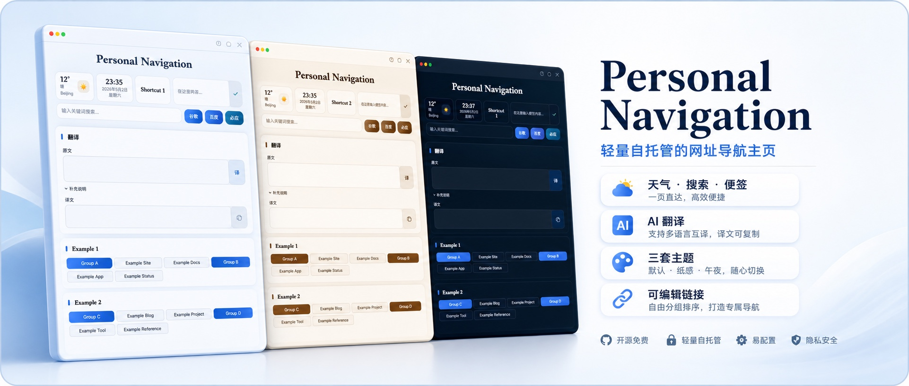
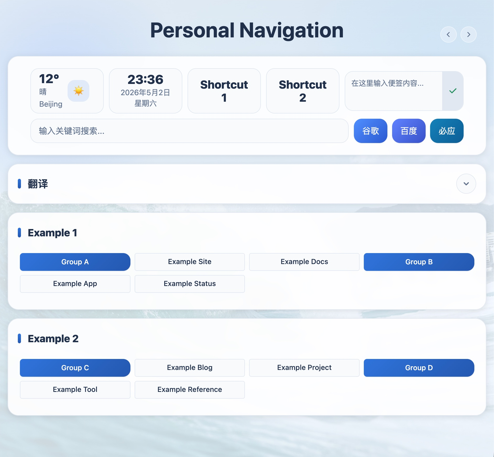
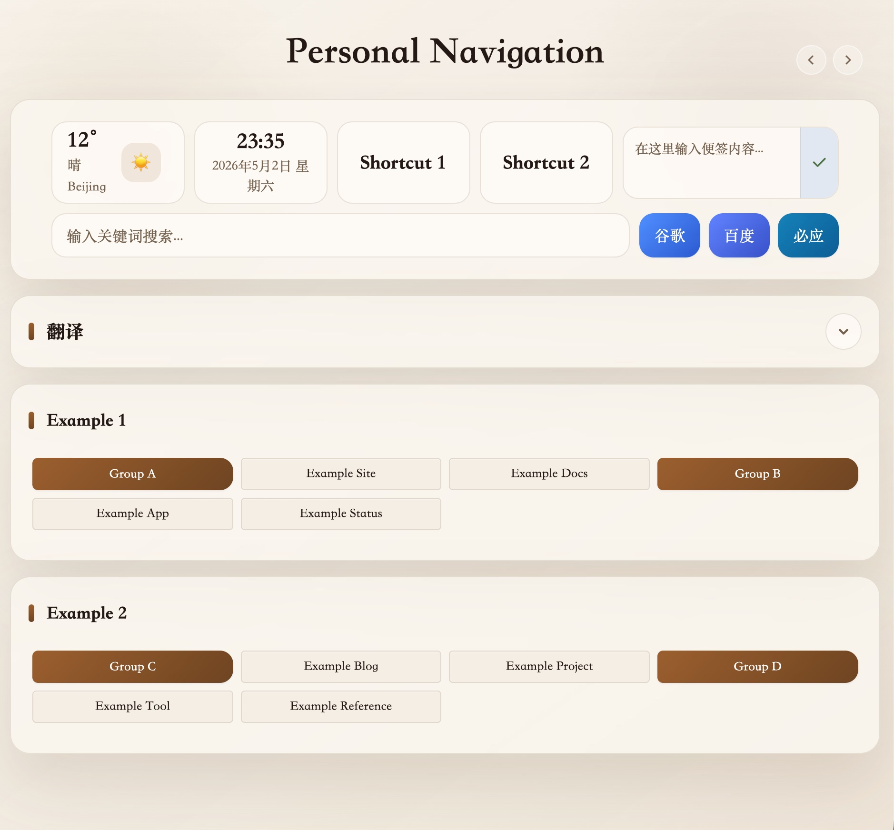
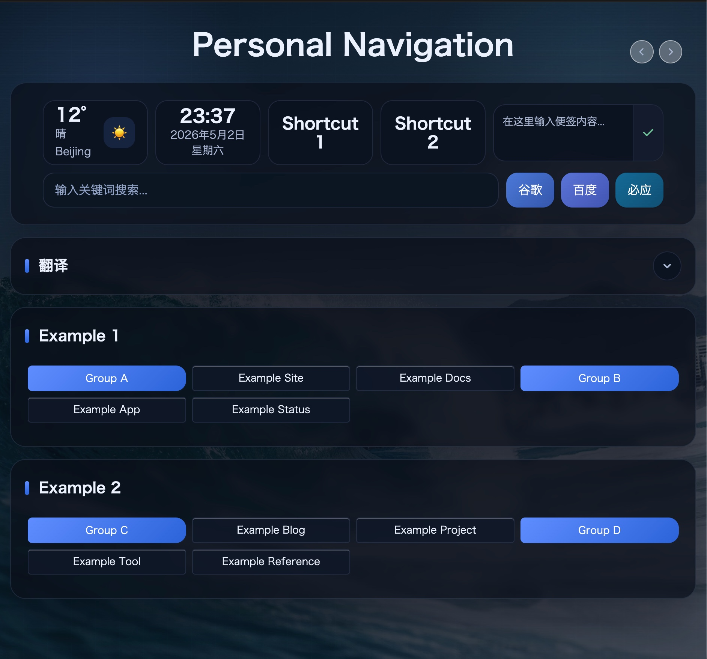
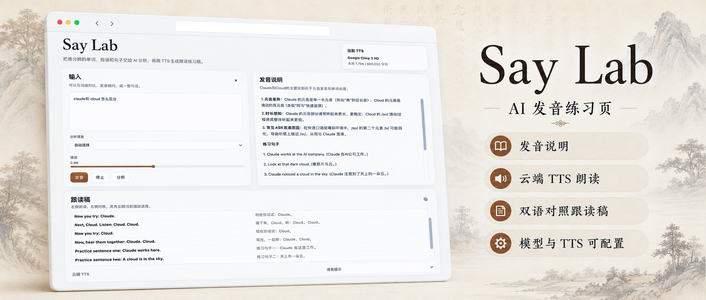
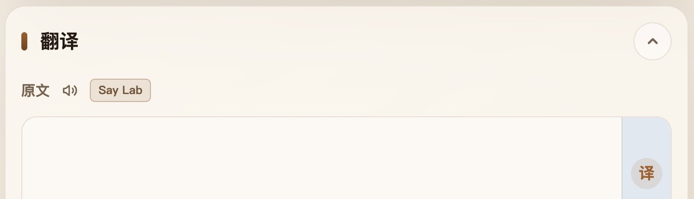

# Personal Navigation



Personal Navigation 是一个轻量的自托管导航主页，用来放常用链接、快速搜索、便签、天气和 AI 翻译。它适合作为浏览器起始页：可以管理导航分类，使用 Google、百度、必应搜索，查看当前天气，保存一段服务器端便签，并用兼容 OpenAI Chat Completions 的模型做翻译。仓库还内置 Say Lab 作为可选集成模块，可以独立运行并从导航页入口打开。

英文文档：[README.en.md](README.en.md)

## 示意图







## 功能

- 可编辑的导航分类和链接
- Google、百度、必应快速搜索按钮
- 基于和风天气的天气组件
- 保存在服务器端的轻量便签
- 可折叠翻译模块，支持原文、补充说明、Markdown 译文、复制和目标语言/自定义目标要求
- 可选集成模块 Say Lab，支持 AI 发音讲解、云端 TTS、读稿和双语对照
- 三个内置主题：默认、纸感、午夜

翻译模块默认按简体中文输出。展开翻译后，点击“译文”两个字可以切换目标语言，也可以输入自定义目标要求。

## 快速开始

```bash
python3 -m venv .venv
source .venv/bin/activate
pip install -r requirements.txt
python app.py
```

然后打开：

```text
http://127.0.0.1:5555
```

生产环境可以放在自己的 Web 服务器或进程管理器后面运行：

```bash
gunicorn -c gunicorn_conf.py app:app
```

## 配置

推荐用环境变量配置。常用配置项可以参考 `env.example`。

| 变量 | 作用 | 默认值 |
| --- | --- | --- |
| `SITE_TITLE` | 页面标题和主标题 | `Personal Navigation` |
| `DEFAULT_WEATHER_LOCATION_ID` | 默认和风天气城市 ID | `101010100` |
| `DEFAULT_WEATHER_LOCATION_NAME` | 天气加载前显示的默认城市名称 | `Beijing` |
| `DEFAULT_SEARCH_ENGINE` | 搜索框按回车时使用的搜索引擎。可选值：`google`、`baidu`、`bing` | `google` |
| `SHORTCUT_ONE_LABEL` | 第一个快捷卡片的显示名称 | `Shortcut 1` |
| `SHORTCUT_ONE_URL` | 第一个快捷卡片打开的地址 | `https://example.com/shortcut-1` |
| `SHORTCUT_TWO_LABEL` | 第二个快捷卡片的显示名称 | `Shortcut 2` |
| `SHORTCUT_TWO_URL` | 第二个快捷卡片打开的地址 | `https://example.com/shortcut-2` |
| `SAY_LAB_URL` | Say Lab 入口地址；留空时不显示入口 | 空 |
| `NAV_DEFAULT_TITLE_FONT` | 默认主题标题字体 | `system-ui` |
| `NAV_DEFAULT_BODY_FONT` | 默认主题正文和控件字体 | `system-ui` |
| `NAV_EDITORIAL_TITLE_FONT` | 纸感主题标题字体 | `Songti SC` |
| `NAV_EDITORIAL_BODY_FONT` | 纸感主题正文和控件字体 | `Songti SC` |
| `NAV_MIDNIGHT_TITLE_FONT` | 午夜主题标题字体 | `Hiragino Sans GB` |
| `NAV_MIDNIGHT_BODY_FONT` | 午夜主题正文和控件字体 | `Hiragino Sans GB` |
| `QWEATHER_API_KEY` | 和风天气 API key，用于天气和城市搜索 | 空 |
| `NAV_TRANSLATOR_API_KEY` | 翻译模型服务的 API key | 空 |
| `NAV_TRANSLATOR_BASE_URL` | 兼容 OpenAI 的 API base URL | `https://api.siliconflow.cn/v1` |
| `NAV_TRANSLATOR_MODEL` | 翻译模块使用的聊天模型 | `deepseek-ai/DeepSeek-V3.2` |
| `NAV_TRANSLATOR_TIMEOUT` | 翻译请求超时时间，单位秒 | `90` |

翻译模块也支持读取 `SILICONFLOW_API_KEY` 或 `DEEPSEEK_API_KEY`，方便使用供应商命名的环境变量。

Say Lab 读取同一个 `.env`。常用配置包括 `SAY_CONFIG_TOKEN`、`SAY_LLM_*`、`SAY_GOOGLE_*`、`SAY_TTS_GOOGLE_RELAY_*` 和 `SAY_TTS_CUSTOM_*`，具体说明见下方可选集成模块章节。

字体配置接受 CSS font-family 写法。应用不内置字体文件；如果用户机器没有配置的字体，浏览器会回到系统 UI 字体栈。

也可以用本地配置文件配置翻译模块：

```bash
cp translator_config.example.json translator_config.json
```

`translator_config.json` 只放在实际运行应用的机器上。若部署平台支持密钥管理，也可以改用环境变量。

## 导航数据

编辑 `data.py` 配置导航分类和链接：

```python
websites = {
    'Example 1': {
        'Group A': [
            {'name': 'Example Site', 'url': 'https://example.com/'},
            {'name': 'Example Docs', 'url': 'https://example.com/docs'},
        ],
    },
    'Example 2': {
        'Group B': [
            {'name': 'Example Tool', 'url': 'https://example.net/tool'},
        ],
    },
}
```

顶层 key 是分类。分类可以继续分组，也可以直接放链接。页面里的编辑控件也能更新导航数据，并保存回 `data.py`。

## 主题

应用在 `app.py` 里内置了三个主题：

- `default`
- `editorial`
- `midnight`

页面会显示主题切换按钮，浏览器会记住已选择的主题。如果要新增主题，可以在 `THEME_PRESETS` 中加一个主题 ID，并在 `static/css/index.css` 中补对应的 CSS 变量。

## 安全说明

这个应用不内置登录系统。如果你要把它暴露到公网，请放在自己的访问控制、反向代理认证、VPN 或私有网络后面。

API key、本地翻译配置、便签、应用保存的数据和日志只应保存在服务器本地。不要公开包含个人链接、便签或凭据的文件。

## 可选集成模块

### Say Lab

Say Lab 是 Personal Navigation 的可选发音练习模块。它作为同仓库内的独立 Go 服务运行，并和导航站共用仓库根目录的 `.env` 配置。



#### 开启导航入口

在 `.env` 中设置 `SAY_LAB_URL` 后，导航页会显示 Say Lab 入口；留空时不显示入口。



```text
SAY_LAB_URL=https://say.example.com/
```

生产环境通常把导航站和 Say Lab 分别交给进程管理器运行，再用 Web 服务器把 `SAY_LAB_URL` 指向 Say Lab 服务。

#### 运行服务

```bash
cd say-lab
go run .
```

默认监听：

```text
http://127.0.0.1:5567
```

部署时建议把进程工作目录设为 `say-lab`，这样 `SAY_DATA_FILE=data/usage.json` 会保存到 Say Lab 模块自己的数据目录。

生产环境可以编译为二进制：

```bash
cd say-lab
go build -o say-lab
./say-lab
```

#### 配置

Say Lab 会按顺序读取：

```text
SAY_ENV_FILE
NAV_ENV_FILE
../.env
.env
```

放在仓库根目录的 `.env` 可以同时服务导航站和 Say Lab。`say-lab/config.example.json` 可作为配置结构参考，详细配置细节可参考 [Say Lab 独立仓库](https://github.com/Liu-Bot24/say-lab)。

常用配置项：

| 配置 | 作用 |
| --- | --- |
| `SAY_CONFIG_TOKEN` | 前端配置面板的可选口令；留空时不启用口令校验 |
| `SAY_LLM_*` | 发音分析使用的大模型配置 |
| `SAY_GOOGLE_*` | Google TTS 服务账号配置 |
| `SAY_TTS_GOOGLE_RELAY_*` | Google TTS 中转配置 |
| `SAY_TTS_CUSTOM_*` | 自定义 OpenAI-compatible Speech API 配置 |
| `SAY_TTS_AUTO_ORDER` | 自动选择 TTS 时的顺序，默认 `google_chirp,google_wavenet,custom` |

#### TTS 中转

`SAY_TTS_GOOGLE_RELAY_ENDPOINT` 和 `SAY_TTS_GOOGLE_RELAY_SECRET` 用于配置 Google TTS 中转。

`SAY_TTS_GOOGLE_RELAY_PASS_CONFIG=false` 时，Say Lab 只把文本和朗读参数发给中转，Google 凭据由中转服务自己保存。

`SAY_TTS_GOOGLE_RELAY_PASS_CONFIG=true` 时，Say Lab 会把本地 Google TTS 配置随签名请求传给中转，适合只做转发的中转服务。
